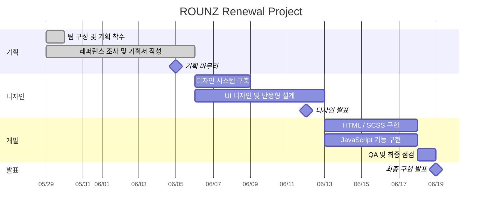

# ROUNZ Renewal Project

> AI 기반 가상 피팅 아이웨어 플랫폼 **ROUNZ**를
> 데스크탑 사용자 경험과 상품 탐색 중심으로 리뉴얼한 프로젝트입니다.

---

- 과정명 : 프로젝트기반 프론트엔드 개발자 양성
- 프로젝트 기간 : 2025/05/29 ~ 2025/06/19
- 프로젝트 차수 : 2차 프로젝트

---

# 🔗 빠른 링크

- 📑 [기획서 (Figma Slide)](https://www.figma.com/slides/AHymjPNruXYlu6MR5QrBc7)
- 🎨 [디자인 원본 (Figma)](https://www.figma.com/design/6jgwNvxFlyrqz5Oykv0spr/%EB%94%94%EC%9E%90%EC%9D%B8?node-id=0-1&t=bi0Vl7m93YzE4wWc-1)
- 🌐[ROUNZ Renewal Project](https://jeju-ratus.github.io/est_fe13_2nd_project/)

---

# 1. 프로젝트 개요

## 1.1 프로젝트 목표

기존 ROUNZ 서비스는 모바일 앱 중심의 가상 피팅 경험과 제한적인 데스크탑 사용성으로 인해 사용자 접근성이 낮다는 문제점이 있었습니다.

본 프로젝트는 이러한 문제를 개선하기 위해

- Hero 영역을 활용한 가상 피팅 CTA 강화
- Chip Filter 기반 상품 탐색 UX 개선
- 상품 정보 구조화 및 시각화
- LocalStorage 기반 장바구니 기능 구현
- 반응형 그리드 시스템 설계
- 웹 접근성 및 SEO 개선

을 목표로 리뉴얼 프로젝트를 진행하였습니다.

---

## 1.2 팀원

| 이름   | 역할                      | 주요 담당                                                                                                                     | GitHub                                              | 연락                    |
| ------ | ------------------------- | ----------------------------------------------------------------------------------------------------------------------------- | --------------------------------------------------- | ----------------------- |
| 최수민 | 팀장 · 기획 · 디자인 · FE | 레퍼런스 분석, 리뉴얼 방향 수립, 디자인 시스템 구축, 메인 페이지 일부, 발표 자료 제작 및 프로젝트 총괄                        | [soomln](https://github.com/soomln)                 | qnfehr948@gmail.com     |
| 송민혁 | 설계 · FE                 | 메인 페이지, Header/Footer, 페이지 구조 설계, 컴포넌트 구조 설계, 상세페이지 UX 설계, Git 운영 및 병합 관리, 반응형 구조 설계 | [JEJU-Ratus](https://github.com/JEJU-Ratus)         | minhyeoksong3@gmail.com |
| 최성호 | FE · 디자인               | 상품 상세 페이지 구현, 상품 정보 레이아웃 구성                                                                                | [RONNIECHOI0324](https://github.com/RONNIECHOI0324) | chltjdgh0001@naver.com  |
| 강형규 | FE · 디자인               | 장바구니 페이지, 고객센터(Q&A) 페이지, 상품 상세 페이지 일부 지원                                                             | [hgkang2](https://github.com/hgkang2)               | hgkang2hank@naver.com   |
| 최예빈 | FE · 디자인               | 로그인 페이지, 회원가입 페이지, 폼 레이아웃 및 사용자 인터페이스 구성                                                         | [yebin-1129](https://github.com/yebin-1129)         | cyb11299@gmail.com      |

---

## 1.3 마일스톤

### 05/29

- 팀 구성
- 서비스 선정
- 현황 분석
- 기획 착수

### 05/29 ~ 06/05

- 레퍼런스 조사
- 벤치마킹
- 사용자 흐름 설계
- 요구사항 정의
- 기획서 작성

### 06/05

- 기획 마무리
- 발표 자료 초안 작성

### 06/06 ~ 06/12

- 디자인 시스템 구축
- 페이지 디자인
- 반응형 시안 제작
- 디자인 검수

### 06/12

- 디자인 발표

### 06/13 ~ 06/19

- HTML 구조 작성
- SCSS 스타일링
- JavaScript 기능 구현
- LocalStorage 연동
- 반응형 구현
- 최종 테스트 및 QA

### 06/19

- 최종 구현 발표

---

### 📊 간트차트



---

## 1.4 현황 분석

### 장점

- AI 기반 가상 피팅 서비스를 제공하여 온라인 안경 구매의 진입장벽을 낮춤
- 다양한 브랜드와 상품 정보를 제공하여 상품 선택 폭이 넓음
- 모바일 앱 중심의 서비스 경험이 잘 구축되어 있음
- 상품 상세 정보 및 렌즈 옵션 정보를 제공함

---

### 문제점

#### 1. 가상 피팅 접근성 문제

- 가상 피팅 기능 이용을 위해 모바일 앱 설치가 필요함
- PC 환경에서 가상 피팅 기능 접근성이 낮음
- 핵심 서비스임에도 메인 화면에서의 노출 비중이 부족함

#### 2. 상품 탐색 UX 문제

- 필터 구조가 직관적이지 않음
- 선택한 필터를 한눈에 확인하기 어려움
- 필터 해제 과정이 번거로움
- 상품 비교를 위한 정보 탐색 효율이 낮음

#### 3. UI/UX 문제

- 모바일 중심 레이아웃이 데스크탑 환경에서 비효율적으로 확장됨
- 콘텐츠 밀도가 높아 정보 파악이 어려움
- 중요 콘텐츠 간 위계가 명확하지 않음

#### 4. 브랜드 경험 문제

- 프리미엄 아이웨어 플랫폼 이미지 전달이 부족함
- 프로모션 중심의 콘텐츠 구성으로 서비스 핵심 가치 전달이 약함
- 가상 피팅 서비스의 차별성이 시각적으로 강조되지 않음

#### 5. 웹 접근성 및 기술적 문제

- 키보드 기반 탐색 지원이 부족함
- 일부 인터랙션이 마우스 사용에 의존함
- 시맨틱 태그 사용이 부족함
- SEO를 고려한 마크업 구조 개선이 필요함

---

### 개선방향

#### 1. 프리미엄 비주얼 강화 및 Hero 영역 CTA 배치

기존 프로모션 중심의 화면 구성을 개선하고, 젠틀몬스터의 미니멀한 UI를 벤치마킹하여 프리미엄 브랜드 이미지를 강화 목표

- Full Width Hero 영역 적용
- 넓은 여백(Negative Space) 활용
- 웹캠 기반 가상 피팅 CTA 배치
- 핵심 서비스 우선 노출

#### 2. 상품 탐색 UX 개선

기존 필터 구조의 불편함을 개선하기 위해 무신사의 Chip Filter UX를 벤치마킹 목표

- 브랜드, 가격대, 프레임 형태 기반 필터링
- 선택 필터 Chip 시각화
- 개별 삭제 및 전체 초기화 기능 제공
- 실시간 상품 목록 갱신

#### 3. 상품 정보 구조화 및 시각화

상품 상세 페이지에서 사용자가 상품 정보를 빠르게 파악할 수 있도록 정보 구조를 개선 목표

- 스펙 정보 구조화
- 카드형 정보 레이아웃 적용
- 상품 정보 가독성 향상
- 구매 의사결정 지원

#### 4. 사용자 인터랙션 개선

사용자가 직관적으로 상품 정보를 확인할 수 있도록 인터랙션을 강화 목표

- 상품 카드 Hover 효과 적용
- 상품 이미지 전환(Fade-in / Fade-out)
- 키보드 탐색 지원
- 접근성을 고려한 Focus 인터랙션 제공

#### 5. 회원 경험 개선

로그인 및 회원가입 과정에서 발생하는 사용자 이탈을 줄이기 위해 실시간 유효성 검사를 적용 목표

- 실시간 Validation
- 정규표현식 기반 입력 검증
- 인라인 에러 메시지 제공
- 즉각적인 사용자 피드백 제공

#### 6. 장바구니 기능 구현

실제 커머스 서비스와 유사한 사용자 경험을 제공하기 위해 장바구니 기능을 구현 목표

- LocalStorage 기반 데이터 저장
- 상품 정보 영속성 유지
- 장바구니 데이터 관리
- 브라우저 재실행 후 데이터 유지

#### 7. 반응형 레이아웃 설계

다양한 디바이스 환경에서 일관된 사용자 경험을 제공할 수 있도록 반응형 구조를 설계하였습니다.

- Desktop (1200px)
- Tablet (768px)
- Mobile (390~430px)

- Desktop 4열 Grid
- Tablet 2열 Grid
- Mobile 1열 Grid

#### 8. 웹 접근성 및 웹 표준 준수

웹 접근성과 유지보수성을 고려하여 웹 표준 기반으로 구현 목표

- Semantic Tag 적용
- alt 속성 제공
- WCAG 명도 대비 준수
- 키보드 접근성 지원
- SEO 최적화 구조 적용
- Lighthouse 성능 개선

---

# 2. 개발 환경 및 배포

## 2.1 개발 스택

### Frontend

- HTML5
- CSS3
- SCSS
- JavaScript
- nodeModule

---

### Tools

- Git
- GitHub
- Figma

---

## 2.2 배포 URL

- [ROUNZ Renewal Project](https://jeju-ratus.github.io/est_fe13_2nd_project/)

---

## 2.3 개발 컨벤션 가이드

프로젝트에서 사용하는 HTML, CSS 작성 규칙은 아래 문서를 참고해주세요.

- [HTML/CSS/JS 컨벤션](CONTRIBUTING.md)

---

# 3. 프로젝트 구조

```bash
est_fe13_2ND_project/
├─ .github/
│  └─ CODEOWNERS
├─ .vscode/
│  └─ settings.json
├─ css/
│  ├─ _colors.scss
│  ├─ _typography.scss
│  ├─ _variables.scss
│  ├─ common.scss
│  ├─ main.scss
│  ├─ cart.scss
│  ├─ login.scss
│  ├─ signup.scss
│  ├─ product-detail.scss
│  └─ support.scss
├─ data/
│  └─ product.json
├─ img/
├─ js/
├─ app.js
├─ common.html
├─ index.html
├─ cart.html
├─ login.html
├─ signup.html
├─ product-detail.html
├─ support.html
├─ package.json
├─ CONTRIBUTING.md
└─ README.md
```

---

# 4. 향후 개선 사항

## 개선 예정 사항

- 실제 웹캠 기반 가상 피팅 기능 구현
- 필터를 통한 chip 필터로 상품필터링 구현
- 상품 검색 기능 추가
- 최근 본 상품 기능 추가
- 상품 비교 기능 추가
- 서버 및 DB 연동을 통한 회원 기능 구현
- 사용자 맞춤 상품 추천 기능 추가
- 접근성 및 성능 최적화

# 5. 제작 후기

## 제작 후기

-

## 팀원 한 줄 회고

- 최수민 :
- 송민혁 :
- 강형규 :
- 최성호 :
- 최예빈 :

# 6. 기획 / 디자인 문서

## 📑 기획서 (Figma Slide)

- 사용자 흐름
- 요구사항 정의
- 스토리보드
- 발표 자료

🔗 [기획서 (Figma Slide)](https://www.figma.com/slides/AHymjPNruXYlu6MR5QrBc7)

---

## 🎨 디자인 원본 (Figma)

- UI 디자인
- 반응형 구조
- 컴포넌트 설계
- 디자인 시스템

🔗 [디자인 원본 (Figma)](https://www.figma.com/design/6jgwNvxFlyrqz5Oykv0spr/%EB%94%94%EC%9E%90%EC%9D%B8?node-id=0-1&t=bi0Vl7m93YzE4wWc-1)

---

# 7. 미리보기

<p align="center">
  
</p>
